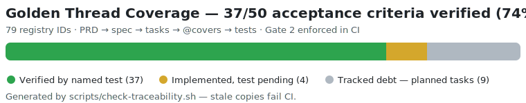
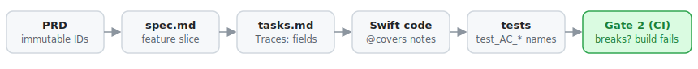

# HomesFlow

> I'm a product and engineering leader with 25 years in software delivery. I built this to find out whether AI-assisted development can hold up to the same rigor I've always encouraged from teams. Short answer: it can, and the sprint that proved it took a few days, not months.

A home management app for owners of multiple properties who need to coordinate maintenance and usage with family or a caretaking team.

Also, a working case study in how to bring real product discipline, traceability, and architectural rigor to AI-assisted development. Built spec-first, iteratively, with traceable requirements and proper verification & validation, because I've spent years watching teams skip the rigor, and I wanted to prove that AI assistance makes software craftsmanship so affordable it's practically a fiscal imperative.

**If you have five minutes:** look at the [coverage matrix](specs/001-mvp/coverage.md) for scope and build state, read [traceability.md](traceability.md) for how the thread works, then [HomesFlow.prd.md](HomesFlow.prd.md) for the product itself.

---

## The Golden Thread

Every requirement in this repo is traceable end-to-end, from product intent to the named test that verifies it, and CI **fails the build** if that thread breaks anywhere.



How one thread runs, using a real example:

1. **Requirement**: the PRD defines `AC-HOME-13`: file preview must open in system Quick Look ([HomesFlow.prd.md](HomesFlow.prd.md), authoritative ID registry).
2. **Plan**: `specs/001-mvp/tasks.md` task `T065e` declares `Traces: AC-HOME-13`; the implementation carries `@covers AC-HOME-13` in `DocumentQuickLookPreview.swift`.
3. **Proof**: the test suite names the criterion: `test_AC_HOME_13_streams_download_to_preview_directory`. The gate script cross-references all four artifacts on every push.



No orphan code, no silent scope, no untracked debt: an acceptance criterion is either verified by a test that names it, or it appears in an unchecked task; anything else fails `scripts/check-traceability.sh`. The [coverage matrix](specs/001-mvp/coverage.md) is a generated portfolio snapshot (regenerate with `--matrix` before hiring or release pushes); CI enforces integrity, not file freshness. Mechanics are documented in [traceability.md](traceability.md).

## Core documents

| Document | Role |
|----------|------|
| **[Story map](https://homeflow.storiesonboard.com/m/homeflow1)** (StoriesOnBoard) | Product planning view: releases, story slices, and what's next; feeds the PRD |
| **`HomesFlow.prd.md`** | Product requirements, user stories, acceptance criteria |
| **`.specify/memory/constitution.md`** | Non-negotiable architectural and process laws |
| **`traceability.md`** | How IDs flow from PRD → spec → tasks → code → tests |
| **`specs/001-mvp/craft-conventions.md`** | Swift, shell, lint, and Sonar policy (craft gates) |
| **`specs/001-mvp/dev-notes.md`** | Environments, deployment, feature breadcrumbs, platform backlog |

## Repository layout

```text
HomesFlow/
├── HomesFlow.prd.md              ← product truth (you write / maintain)
├── traceability.md              ← traceability mechanics
├── glossary.md                  ← domain terms
├── archive/
│   └── process.deprecated.rtf  ← archived process narrative (superseded by markdown above)
├── .specify/                    ← Spec Kit (templates, scripts, constitution)
│   └── memory/constitution.md  ← non-negotiable laws
├── ios/                         ← SwiftUI app (XcodeGen)
├── supabase/                    ← migrations + local config
└── specs/
    └── 001-mvp/                 ← active feature (spec → plan → tasks → code)
        ├── spec.md
        ├── plan.md              (after /speckit.plan)
        └── tasks.md             (after /speckit.tasks)
```

## Spec Kit workflow

Active feature: **`001-mvp`**

```bash
export SPECIFY_FEATURE=001-mvp
export SPECIFY_FEATURE_DIRECTORY=specs/001-mvp
```

| Step | Command | Output |
|------|---------|--------|
| 1 | `/speckit.specify` | Fills `specs/001-mvp/spec.md` from `HomesFlow.prd.md` |
| 2 | `/speckit.clarify` | Resolves open questions |
| 3 | `/speckit.plan` | `plan.md`, `research.md`, `data-model.md` |
| 4 | `/speckit.tasks` | `tasks.md` with `Traces:` fields |
| 5 | `/speckit.analyze` | Gate: must pass before coding |
| 6 | `/speckit.implement` | `ios/`, `supabase/` |

## Quality checks

| Gate | What | CI |
|------|------|-----|
| **Gate 0** | Build + unit tests + SwiftLint + shellcheck | `.github/workflows/ci.yml` |
| **Gate 2** | Golden thread (`check-traceability.sh`) | same workflow (ubuntu job) |
| **SonarCloud** | Static analysis ([dashboard](https://sonarcloud.io/project/overview?id=rdryfoos_HomeFlow)); policy in `sonar-project.properties` | SonarCloud on push |

Local:

```bash
bash scripts/check-traceability.sh          # Gate 2
bash scripts/check-traceability.sh --matrix # portfolio snapshot (coverage.md)
shellcheck scripts/*.sh
cd ios && swiftlint lint --config .swiftlint.yml
```

Craft conventions: `specs/001-mvp/craft-conventions.md`. Sonar suppressions: `specs/001-mvp/sonar-disposition.md`.

## Run locally (Phase 0)

```bash
supabase start && supabase db reset
cp ios/HomeFlow/Resources/Secrets.xcconfig.example ios/HomeFlow/Resources/Secrets.xcconfig
# Paste SUPABASE_URL and SUPABASE_ANON_KEY from `supabase start` output
cd ios && xcodegen generate && open HomeFlow.xcodeproj
```

UI reference (non-authoritative): https://haze-rabbit-58180688.figma.site

**Before step 1:** Add durable IDs to requirements and ACs in `HomesFlow.prd.md` per `traceability.md` §3.

## What not to duplicate

- Do **not** maintain a separate root `spec.md` / `plan.md`: Spec Kit uses `specs/<feature>/`.
- Do **not** rewrite the PRD into the feature spec by hand; let `/speckit.specify` derive the feature slice.

